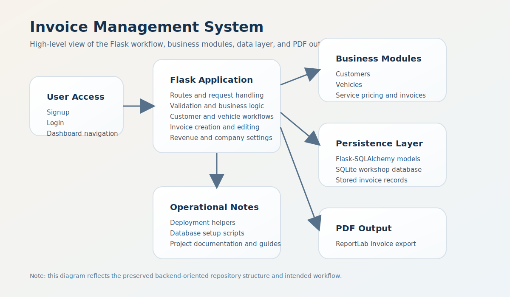
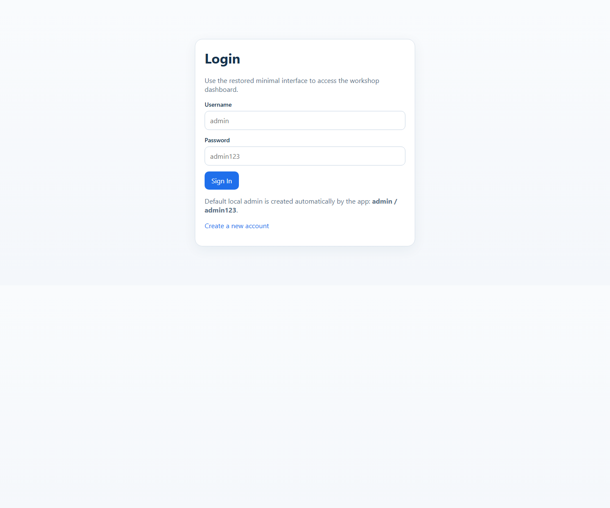
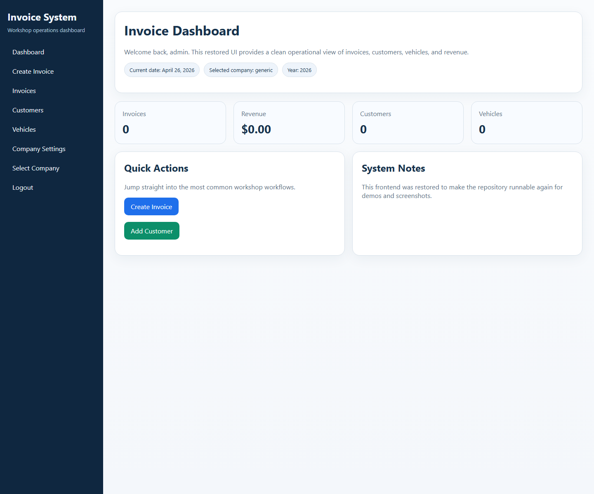
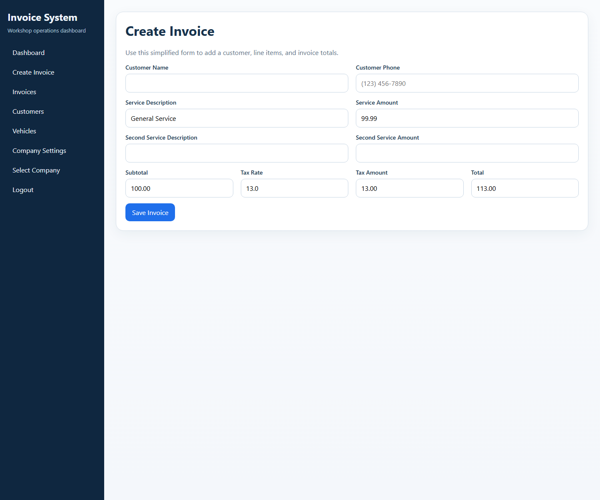
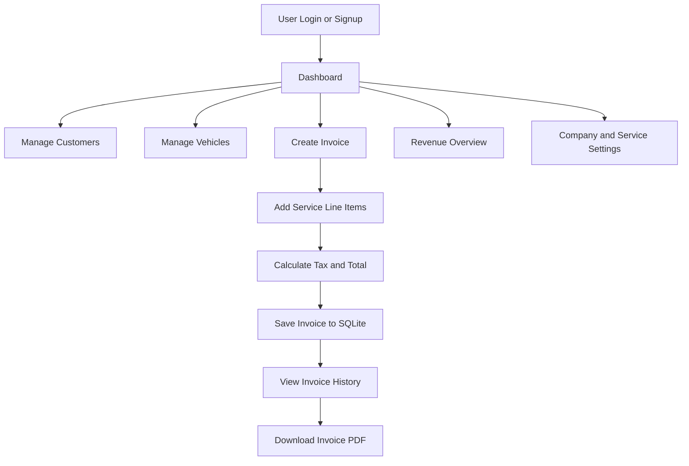

# Invoice Management System

A Flask-based business application for managing workshop customers, vehicles, invoices, service pricing, and PDF invoice generation. This project was built around a mechanic-shop workflow and focuses on practical back-office operations rather than a toy CRUD demo.



## Restored Frontend Preview

| Login | Dashboard |
| --- | --- |
|  |  |

| Create Invoice |
| --- |
|  |

## Overview

This repository preserves the main backend implementation for a workshop invoicing system with:

- customer account and login flows
- customer and vehicle record management
- invoice creation with multiple service line items
- tax, subtotal, and total calculations
- company-specific service catalogs
- revenue visibility and invoice history
- PDF invoice export using ReportLab

The core logic is present in [`app.py`](app.py), and the database/model layer is implemented with Flask-SQLAlchemy on top of SQLite.

## Tech Stack

| Layer | Tools |
| --- | --- |
| Backend | Flask |
| ORM | Flask-SQLAlchemy, SQLAlchemy |
| Database | SQLite |
| PDF generation | ReportLab |
| Utilities | Pillow, python-dateutil |
| Deployment notes | Gunicorn, Heroku-oriented helper files |

## Feature Highlights

- Customer management
  - register and store customer name, phone, email, and address
- Vehicle management
  - maintain customer-linked vehicle records with year, make, model, VIN, and license plate
- Invoice workflow
  - create invoices with dynamic line items and automatic total calculation
- Company-specific services
  - switch between service/company profiles and maintain custom pricing
- Revenue visibility
  - inspect invoice totals and business activity from stored records
- PDF export
  - generate downloadable invoice PDFs for printing or sharing

## Application Flow



## Main Files

- [`app.py`](app.py): primary Flask application, routes, models, and business logic
- [`generate_invoice_pdf.py`](generate_invoice_pdf.py): PDF invoice export logic
- [`initialize_db.py`](initialize_db.py): database initialization helper
- [`setup_database.py`](setup_database.py): additional database setup script
- [`BUILD_GUIDE.md`](BUILD_GUIDE.md): implementation and deployment notes
- [`VALIDATION_REPORT.md`](VALIDATION_REPORT.md): progress and validation notes
- [`deployment_options.md`](deployment_options.md): deployment reference options

## Repository Status

This repo is valuable because the backend logic is substantial and the business workflow is real. At the same time, the repository is best described as a preserved working codebase rather than a perfectly packaged production release.

Current status:

- the main Flask application logic is present
- the SQLAlchemy models and database helpers are present
- PDF generation support is present
- deployment-oriented notes and helper scripts are present
- a minimal runnable template set has now been restored for demo and portfolio use

That means the strongest honest claim is:

> This repository captures the core implementation and business logic of the Invoice Management System, and now includes a restored minimal frontend layer for local demos, screenshots, and portfolio presentation.

## Local Setup

### 1. Create a virtual environment

```bash
python -m venv venv
```

### 2. Activate it

On Windows:

```powershell
venv\Scripts\activate
```

### 3. Install dependencies

```bash
pip install -r requirements.txt
```

### 4. Initialize the database

```bash
python initialize_db.py
```

If needed, you can also run:

```bash
python setup_database.py
```

### 5. Start the application

```bash
python app.py
```

Expected local URL:

```text
http://127.0.0.1:5000
```

The repository also includes convenience launchers:

- [`start.bat`](start.bat)
- [`start_server.bat`](start_server.bat)
- [`run_local_server.py`](run_local_server.py)

## Expected User Workflow

1. sign up or log in
2. add customers
3. register vehicles
4. create invoices with service items
5. save and review invoice history
6. export invoice PDFs
7. inspect revenue-related summaries

## Cleanup Notes

This repository can still be improved further by:

- adding a `static/` folder for CSS, JS, and images
- reducing duplicated deployment notes across multiple documentation files
- expanding the restored minimal template set into a fuller production UI

## Why This Project Matters

This is a strong portfolio project because it demonstrates:

- practical business application design
- database-backed workflow automation
- invoice and service-management logic
- PDF document generation
- route-heavy Flask application structure
- real-world CRUD and reporting patterns

## Author

Abubakar Shahid  
GitHub: <https://github.com/abubakarshahid16>

## License

No explicit license file is currently included in this repository. Add one if you want to formalize reuse permissions.
